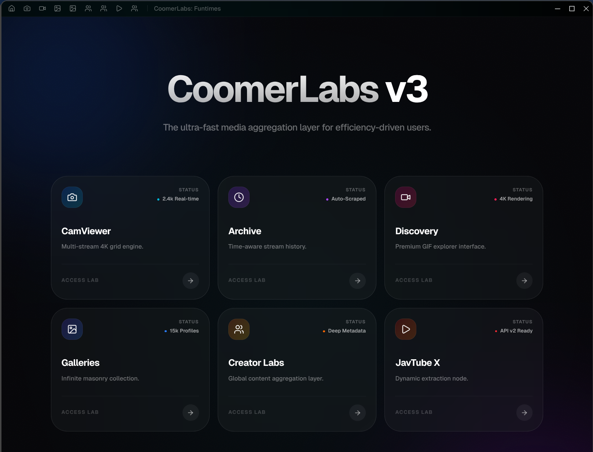

<div align="center">
  

  <p align="center">
 Coomerlabs: Funtimes
  </p>

  [](LICENSE)
  [](https://www.typescriptlang.org/)
  [](https://reactjs.org/)
  [](https://github.com/aiwag/coomerlabs/releases)
</div>

---
Why?
```markdown
Coz ads and popups are a pain. CoomerLabs is a content aggregator for the modern desktop. Chaturbate, Redgifs, Wallhaven, Fapello, and more. CouchSitting at its finest.
```

### 🚀 Core Features

- **CamViewer**: Multi-stream 4K monitoring with zero-lag grid layouts.
- **Unified Discovery**: Integrated explorers for RedGifs, Wallhaven, Fapello, and more.
- **Archive Engine**: High-speed profile archiving and video extraction.
- **Performance First**: Up to 70% reduction in CPU & memory overhead vs standard browsers.

### 🛠️ Technology Stack

- **Runtime**: Electron + Bun
- **Frontend**: React 19, TanStack Router, Tailwind CSS
- **State**: Zustand + React Query
- **Animation**: Framer Motion
- **Scraping**: JSDOM + Lifecycle Interceptors

### 📦 Quick Setup

```bash
# Clone & Install
git clone https://github.com/aiwag/coomerlabs.git
cd coomerlabs
bun install

# Launch Development
bun start

# Build Binaries
bun run make
```

### 📈 Performance Benchmarks

| Metric | Savings | Technical Implementation |
| :--- | :--- | :--- |
| **CPU Usage** | **-50%** | `React.memo` + Reference stability |
| **Memory** | **-30%** | Aggressive webview partition isolation |
| **Re-renders** | **-70%** | Throttled DOM observers & state slicing |

### 🤝 Contributing

We welcome performance-driven contributions. Please see our [Contributing Guide](CONTRIBUTING.md).

---

<div align="center">
  <p><em>Built for performance excellence.</em></p>
  <sub>Made with ❤️ by the CoomerLabs Team</sub>
</div>